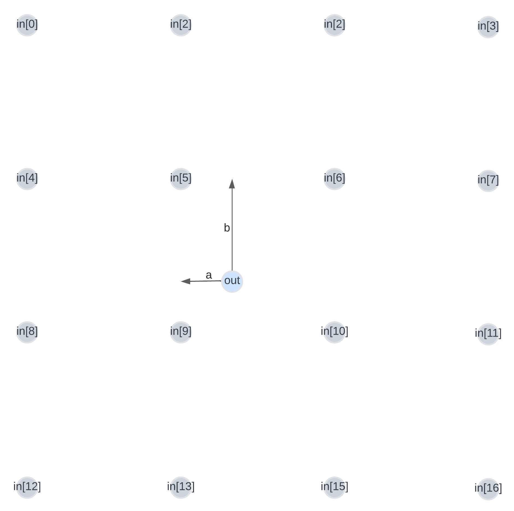
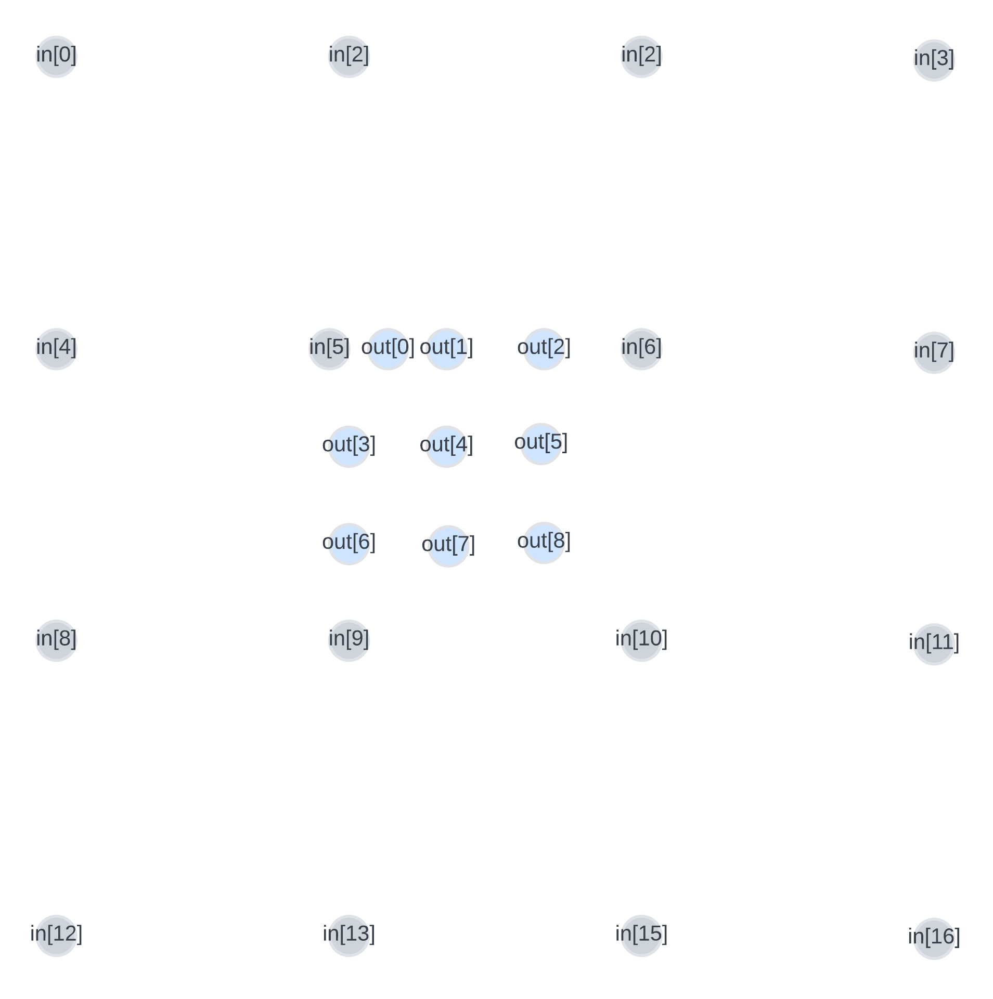

# Bicubic interpolation (Wenlin Yi)

In the ESPCN python code, one of the key feature is it's interpolation and pixels shuffle layer library tf.nn.depth_to_space, the interpolation layer convolute with all channels use tf.nn.depth_to_space to convert into a spacial domain. Due to the complexity and time constrain, ```layers.Conv2D(channels * (upscale_factor**2), 3, **conv_args)``` in hardware is replaced with bicubic interpolation instead. Although bicubic interpolation does not involve any training, but it calculate pixels of new information and is more accurate than linear or nearest neighbour interpolation, and commonly used in industry. 

## Generating a new pixel depending on the distance to nearest existing pixels

The new pixel is generated given the distance from input pixel 5. The distance between two adjacent pixels is one, and the algorithms is given at: https://uk.mathworks.com/matlabcentral/answers/405846-bicubic-interpolation-direct-interpolation-formula-matlab-source-code


In this way, it allow us fit this algorithm to any enlarge scales, all the new pixels will having a multiple of 1/scale x and y distance to input pixel 5. And to customise the enlarge scale, input the 1/scale parameter to the top level ip, otherwise in the testing, its default value set by local parameter of x3. float 16 multiplier is added in hope to accelerate the calculation further.

## Generating a block of new pixels for one inputs' gap

This block uses the above module to generate all the new pixels in a top-left block between the input 5, 6, 9, 10, to fill all the gap in the wantted enlarge scale. To generate a top-left block allows all the block gerenated inlay well.


## Padding the inputs

At edges of the image, there is not enough pixels (16 pixels) to perform the algothm, therefore, the image is padded by 1, and padding value is taking the nearest neighbour value.

## Fill all the blocks(unrolled and 28rolled)

top level config: 20ns 50MHz

In this module, it takes the inputs as a 1d bus array and then tranfor into a 2d array. Then add padding to the 2d inputs. In the unrolled version, it generated 28*28, 783 generating_blockpixels module in total and aim to generating all of the new pixels in parallel in 1 clock cycle. In the 28rolled version, It uses one generating_blockpixels model for each row of blocks of pixels in parallel, aiming to spend 28 clock cycles to produce a row of blcoks of pixels, and all 28 rows are running inparallel.
