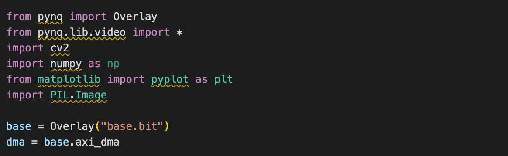
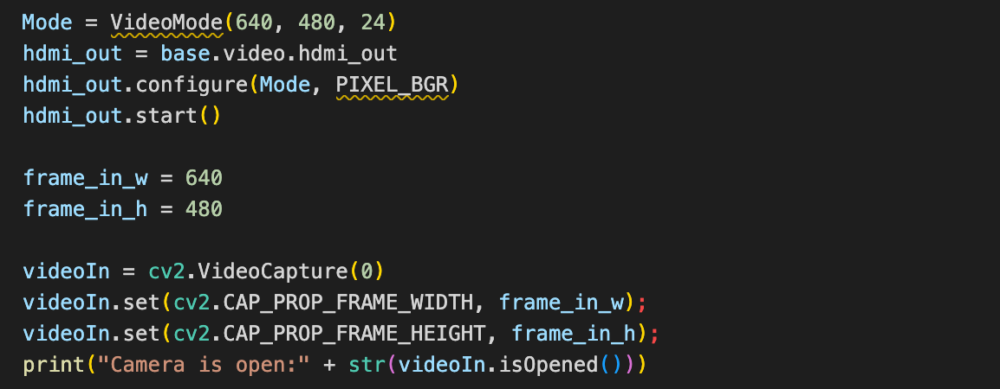
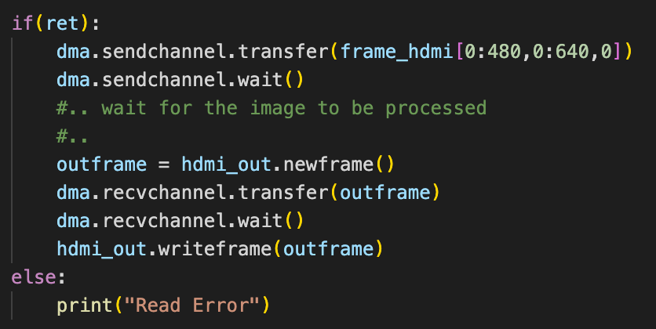
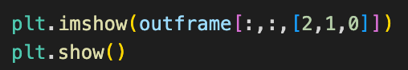

# Super_Resolution_Display (Yuze Feng)

  
Aiming to achieve Real-Time Image Processing, a USB webcam is used. The pictures captured are transferred to DMA for processing(Super Resolution).
  

## 1. Import Libraries and load Overlay
  

Import the libraries needed

## 2. Initialisation

Setup USB Webcam and HDMI out

## 3. Capture a frame

## 4. Frame Transfer

## 5. Show output result in Jupyter Notebook

