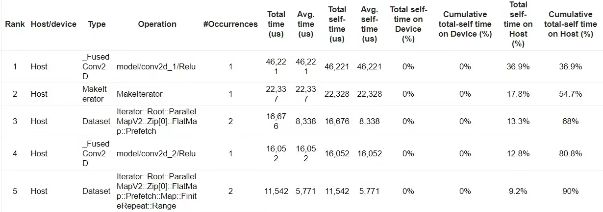
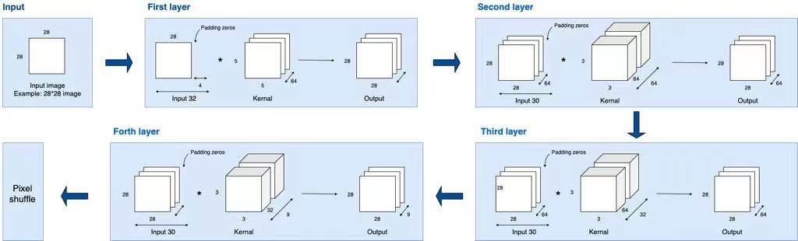

# Super_Resolution_Hardware_IPs (Jingyi Liang)

Given the result of profiling, convolutional layers of ESPCN take the most of time. Therefore, Vivado 2022.2 is used to re-design the convolutional layer of ESPCN on hardware to accelerate the application. 
 

 
**profiling result**

## ESPCN Convolution Neural Network

 
- The ESPCN network has 4 hidden layers, the output is the same size as the input for each layer. Therefore, zero padding is required.
- ESPCN increases the resolution of the image at the last layer of the neural network, this reduces the computational complexity.
- The last layer is the efficient sub-pixel convolutional layer to recover the output image size with a specified upscale factor.
- The architecture of the ESPCN convolution neural network is shown below.
 

 
 

 

## Input and output

