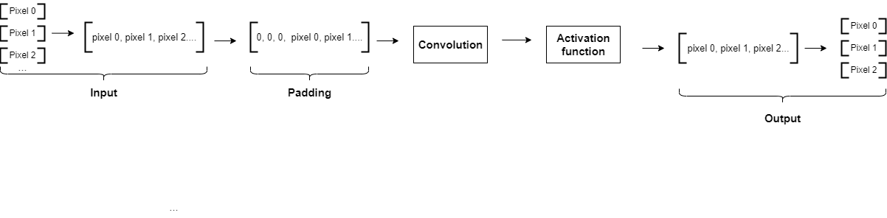

# Super_Resolution_Hardware_IPs (Jingyi Liang)

According to the profiling result, the Relu function of the first convolutional layer of ESPCN takes about 40% of total time, so we want to re-design the first convolutional layer in hardware using Vivado 2022.2. More information about profiling can be found [here](https://github.com/Terrortorpe/FPGA-Consultancy/tree/clean/Super_Resolution_Methods). 

**All the custom IPs**
 
**Input:** FSM_wrapper.v
 
**Conv_layer:** padding.v, conv_layer.v, ReLU.v
 
**Output:** splitting.v
 

## 2D Convolutional layer

 
The idea of a 2D convolutional layer is that the convolution filters slide over the 2D input data and perform an elementwise multiplication, the results will then be summed up into a single output data. 

- The custom conv_layer IP takes in a 1d array of size $imageWidth\times imageHeigth\times wordlength$.
- It will be converted into a 2d array to be ready for convolution operation.
- Then, floating-point multipliers are instantiated to perform an elementwise multiplication, and floating-point adders are used to sum up the results to give the 2D output. 
- Eventually, the 2d output array will be converted back to a 1d array since verilog does not support 2d array as ports of modules, the size of the output array will be $(imageWidth-kernalSize+1)\times (imageHeigth-kernalSize+1)\times wordlength$ .

 

## Relu

After convolution, a Relu activation function is applied to the output data to introduce non-linear properties to the neural network. The Relu activation function is very simple, the curve of the function is shown below. While data is greater than zero, it is set to itself, else it is set to zero.  

- Since pixels are signed 32-bit floating point, the most significant bit represent sign.
- If the MSB is 0, it is set to itself.
- If the MSB is 1, it is set to zero.

 

## Padding

The ESPCN nerual network has the "same" padding and the stride is one, which means the output size will be the same as the input size. Since everytime we do convolution, the size of the image will go smaller, an extra padding.v IP is implemented to preserve the original size of the image.

- The ESPCN nerual network has kernal sizes of 3 or 5, the size of the kernals are odd number.
- For kernal size of 3, one layer of pixel of zeros are added to the surrounding of the image. 
- For kernal size of 5, two layers of pixel of zeros are added to the surrounding of the image.
 
  

## Input and output

Pixel data are transferred between FPGA and CPU using AXI stream, it is always used for high speed streaming data. Since there are limited amount of IOs available on PYNQ Z1 board, one pixel is read or write per one cycle. We can proceed to the next step until all the pixels in the image are read. 

**FSM_wrapper.v**

- The input stage is implemented using custom FSM_wrapper.v IP, it consist a counter and a state machine. 
- The state machine has three states A, B and C, state A is idle state, once the read enable signal is high, it goes to state B. Then if done signal is low, it will goes to state C, at this state, axi stream can read data into the register.
- Until all the data are read, the done signal goes high, and the state machine goes back to state A.

**splitting.v**

- The output state is implemented using splitting.v IP, it consist a counter.
- While write enable signal is high, axi stream starts to read output data pixel by pixel, until all the output pixels are read, the write enable signal goes low.

**top_level.v**
 
- All the custom IPs are integrated to form the top_level.v IP, the architecture of the IP is shown below.
 
 

